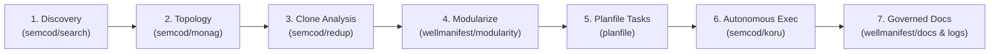

# Wellmanifest Reuse (`wellmanifest/reuse@v1`)

Standard and governed workflow for **cross-project code discovery, deduplication, continuous modularization, and reuse** across the `~/github/*` workspace.

[](#)
[](#)
[](#)

---

## 1. Philosophy: Zero New Code When Existing Code Solves It

In a micro-repo architecture comprising hundreds of projects (`wellmanifest/*`, `semcod/*`, `paxlet-com/*`, `maskservice/*`, `autogrammar/*`, etc.), authoring new utility functions or scaffolding duplicate implementations causes maintenance explosion, interface fragmentation, and tech debt.

**The Wellmanifest Reuse Standard** establishes:
1. **Search Before Generate**: Mandatory indexing and query (`semcod/search` / `subactor-search`) across local projects before creating new logic.
2. **Deterministic Clone Detection**: Systematic AST clone analysis (`semcod/redup`) within and between repositories.
3. **Continuous Modularization**: Extracting shared patterns into focused, single-purpose packages (under `packages/` or dedicated domain repos) governed by `wellmanifest/modularity`.
4. **Planfile Decomposition**: Automated translation of reuse and refactoring opportunities into structured sprint tickets (`planfile.sprint/v1`).
5. **Closed-Loop Autonomous Execution**: Autonomous handoff to `semcod/koru` (`koru --queue`) for hands-free deduplication and validation.
6. **Enforced Documentation & Logs**: Enforcing `wellmanifest/docs` (Compact v2) and `wellmanifest/logs` (error runbooks) across all user-authored, non-fork repositories.

---

## 2. Tool Bindings & Phased Lifecycle



| Phase | Tool | Canonical Command | Role in Reuse Standard |
|:---|:---|:---|:---|
| **Discovery** | [`semcod/search`](https://github.com/semcod/search) | `subactor-search ask "<concept>" --json` | High-speed, local SQLite FTS5 index across ~240 repos. Zero LLM cost. |
| **Topology** | [`semcod/monag`](https://github.com/semcod/monag) | `monag status` / `monag drift` | Multi-repo topology, active agent monitor, worktree registry. |
| **Deduplication** | [`semcod/redup`](https://github.com/semcod/redup) | `redup compare <projA> <projB>` / `redup scan` | AST clone detection, shared LOC measurement, merge/extract recommendations. |
| **Modularization** | [`wellmanifest/modularity`](https://github.com/wellmanifest/modularity) | `modularity check` | Encapsulation boundaries, package separation, pinned interfaces. |
| **Planning** | [`planfile`](https://github.com/wellmanifest/planfile) | `python3 scripts/generate_reuse_plan.py -p <dir>` | Generates structured `planfile.sprint/v1` tickets with tiers and criteria. |
| **Autonomous Delivery** | [`semcod/koru`](https://github.com/semcod/koru) | `python3 -m koru --queue --project <dir>` | Autonomously claims and executes reuse/dedup tickets to green tests. |
| **Documentation** | [`wellmanifest/docs`](https://github.com/wellmanifest/docs) & [`logs`](https://github.com/wellmanifest/logs) | `code2docs` / `docs_check.py --format v2` | Enforces Compact v2 specs (<=120 lines) and structured runbooks (`errors/*.md`). |

---

## 3. Governed Reuse Policy Rules (`REUSE-*`)

The machine-readable specification is defined in [`standard/reuse-policy.json`](standard/reuse-policy.json):

* **`REUSE-001` (Search Before Generate)**:
  Before generating a new utility module, CLI tool, or service component from scratch, the author or autonomous agent MUST query the local workspace index (`subactor-search ask "<concept>"`) for existing implementations.
* **`REUSE-002` (Duplication & Clone Detection)**:
  Repositories MUST be analyzed for AST and block duplication using `semcod/redup`. Internal clone groups with >= 30 lines and >= 0.85 similarity must have an active refactoring plan.
* **`REUSE-003` (Continuous Modularization & Extraction)**:
  When identical or near-identical logic is identified across 2 or more repositories via `redup compare`, the logic MUST be considered for extraction into an independent package (under `packages/<name>` or a dedicated domain repo in `wellmanifest/*` or `semcod/*`) with pinned interfaces.
* **`REUSE-004` (Structured Planfile Decomposition)**:
  Reuse and deduplication efforts MUST be broken down into structured, prioritized tickets in `.planfile/sprints/current.yaml` following the 5-phase lifecycle: `DISCOVER` -> `COMPARE` -> `EXTRACT` -> `CONSUME` -> `VERIFY`.
* **`REUSE-005` (Autonomous Execution Delegation - Koru Handoff)**:
  All generated reuse and deduplication tickets intended for autonomous delivery MUST include `tier: refactor` or `tier: reuse`, labels `[koru-autonomous, reuse]`, deterministic verification commands, and exit code 0 acceptance criteria.
* **`REUSE-006` (Enforced Documentation & Telemetry Standards)**:
  All non-fork, user-authored repositories MUST enforce `wellmanifest/docs` (Compact v2: max 120 lines / 600 words per doc, clear `docs/` index) and `wellmanifest/logs` (`errors/{CODE}.md` runbooks, structured JSONL logs). Documentation auto-sync SHOULD leverage `semcod/code2docs` or `todocs`.

---

## 4. Usage & Conformance Verification

### Check Repository Conformance
```bash
python3 standard/conformance.py --project /path/to/target/project
```

### Validate Policy Schemas
```bash
python3 standard/conformance.py --check-schema
```

### Generate Planfile Tasks for Target Project
```bash
python3 scripts/generate_reuse_plan.py --project /home/tom/github/digitaltwin-run/dock2tauri --topic "tauri"
```

### Dispatching to Koru Autonomous Loop
```bash
python3 -m koru --queue --project /home/tom/github/digitaltwin-run/dock2tauri --actor koru
```
